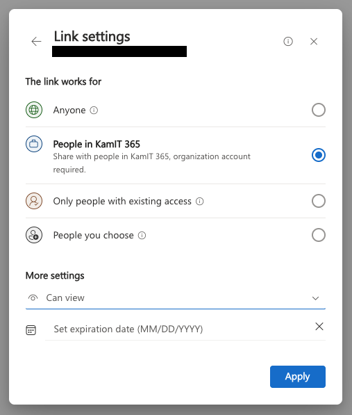

# Yleisohjeet

## Essee

Kurssilla on yksi ainut essee-tehtävä, eli Tekoäly ja etiikka, palautetaan Reppuun PDF-tiedostona. Essee on kirjoitettava suomeksi. Lue tarkemmat ohjeet tehtävän [9: Tekoäly ja etiikka](09_etiikka.md) -dokumentista. Tehtävä arvioidaan Hyväksytty/Hylätty -arvosanoin, ja se on pakollinen kurssin suorittamisen kannalta, kuten kaikki muutkin tehtävät.

## Repositorio

!!! warning

    Käytäthän opettajan sinulle antamaasi repositoriota, jotta opettajalla on automaattisesti pääsy sinun työhösi. Varmista, että repositoryn juuressa on `README.md`-tiedosto, josta alkaen käyttäjä kuljetetaan eri ohjeiden äärelle. Jos dokumentaatio on repositorion punainen lanka, niin `README.md` on lankakerän pää. Siitä on hyvä linkittää kaikkiin ohjeisiin, jotta opettaja löytää ne helposti.

Käytä repositoriossa ns. monorepo-rakennetta, jossa kaikki harjoitukset sijaitsevat samassa repositoriossa. Jokaisella harjoituksella on oma kansio. Esimerkiksi:

```
.
├── README.md
├── flower-model-demo
│   └── Justfile.yml
├── parallelism
│   ├── MEMO.md
│   └── compose.yml
├── fine-tuning
│   └── MEMO.md
└── <ID>
    ├── ...
    └── ...
```

Tarkka repositorion rakenne on sinun päätettävissä. Varmista kuitenkin, että se on selkeä siten, että opettaja löytää `README.md`-tiedoston ja sitä kautta muut harjoitukset. On esimerkiksi täysin sallittua antaa juokseva järjestysnumero tekemisille harjoituksilla, kuten `01_FLOWER`, `02_PARALLELISM` jne.

!!! example "Kurssi syntyy prosessissa"

    Tämä toteutus järjestetään ensimmäistä kertaa syksyllä 2026, joten ns. opettajan esimerkki repositorion rakenteesta elää toteutuksen ajan. Opettajalla ei ole kristallipalloa, jolla näkisi Roihun tulevaisuuteen.
    
    Seuraa Discordia ja sähköpostia, niin pysyt ajan tasalla mahdollisista vinkeistä.

!!! tip "CLI-työskentely"

    Kun ajat harjoituksia, siirry kyseiseen hakemistoon, ja aja komennot siellä. Esimerkiksi jos teet CDC01-harjoitusta, niin:

    ```bash
    cd cdc01
    docker compose up -d
    ```

## Videot

Lähes kaikki kurssin tehtävät ovat videopalautuksia. Video palautetaan linkkinä. Niiden arviointiin käytetän Arviointityökalua asteikolla 0-5.

### Videon tekninen toteutus

#### Jakaminen

Palautus hoidetaan lisäämällä linkki Reppu-palvelun palautuslaatikkoon. Linkin tulee olla luotu siten, että se toimii opettajan koneella. Pikaohje tähän on:

* **Jos YouTube**, valitse Visibility: *Unlisted*.
* **Jos OneDrive**, jaa linkkinä siten, että kaikilla linkin saaneilla (ainakin KamiT AD:ssa) on lupa nähdä se.

OneDrive-kohtaan on alla tarkempi ohje.



**Kuva 1:** *Tiedoston jakaminen OneDrivessä vaatii Share-ominaisuuden käyttöä. Ethän siis kopioi URL:ia selaimen osoiteriviltä vaan käytä Share-ominaisuutta. Kohdasta Link Settings pitäisi löytyä kuvassa näkyvä menu.*

#### Tallennus

Voit tallentaa videon esimerkiksi seuraavilla työkaluilla:

* [Microsoft Clipchamp](https://m365.cloud.microsoft/launch/Clipchamp/). Työkalu on käytettävissä suoraan selaimesta ja video tallentuu pilvipalveluun (KamiT OneDriveen). Kuvanlaatu minun kokeilun perusteella 720p.
* [OBS Studio](https://obsproject.com/). Avoimen lähdekoodin videotallennin ja striimaustyökalu. Tiedosto tallentuu lokaalisti todella hyvälaatuisena ja on täten helposti leikattavissa.

#### Esimerkki

<iframe width="560" height="315" src="https://www.youtube.com/embed/y0AN1tnZok8?si=Mc3VMzgaaAWsrDLV" title="YouTube video player" frameborder="0" allow="accelerometer; autoplay; clipboard-write; encrypted-media; gyroscope; picture-in-picture; web-share" referrerpolicy="strict-origin-when-cross-origin" allowfullscreen></iframe>

**Video 1:** *Esimerkki videosta, joka on toteutettu Clipchampilla. Videon aiheena on Brutus -bruteforcetyökalun minilab.*

Opettajan omat materiaalit on tyypillisesti tallennettu OBS Studiolla, leikattu Adobe Premierellä ja ääniraita on paranneltau Adobe Auditionilla. Jotta odotukset pysyisivät maltillisina, nauhoitin Clipchamp-referenssin maisteriopintojen ohessa kyberturvallisuutta käsittelevälle kursille(ks. Video 1 yltä). Video on tallennettu Ubuntussa Chrome-selaimella, käyttäen tavallista web-kameraa ja langallista headsettiä.

!!!tip

    Huomannet, että 720p-laadun kansssa Videon 1 fonttikoko on aivan ehdoton minimi. Jos sinulla on 4K-työpöytä, kasvata fonttikokoa. Videolla on 1440p resoluutio työpöydässä ja VS Codessa vakio fonttikoko.

#### Leikkaus

Videon leikkaaminen ei ole millään tavoin pakollista. Tämän kurssin videot on mahdollista nauhoittaa yhdellä otolla. Jos kuitenkin haluat leikata videota, siihen soveltuu ainakin:

* [Microsoft Clipchamp](https://m365.cloud.microsoft/launch/Clipchamp/). Online-editori. Ainakin alun ja lopun leikkaus onnistuu helposti.
* [Shotcut](https://shotcut.org/). Avoimen lähdekoodin videoeditointiohjelma, joka on saatavilla useille alustoille.
* [DaVinci Resolve](https://www.blackmagicdesign.com/products/davinciresolve/). Tehokas videoeditointiohjelma, joka tarjoaa laajat ominaisuudet ilmaisversiossaan. Oppimiskäyrä on jyrkähkö.

Suosittelen opiskelijoita jakamaan keskenään vinkkejä helpoista editoreista. Opettajalla on kokemusta pääasiassa Premierestä tai DaVinci Resolvea, jotka eivät ole aivan helpoimmasta päästä.

## Videon sisällölliset ohjeet

Palautat **lyhyt video**. Älä tee tunnin luentoa vaan ns. ==perjantaidemo==, jonka voisi esittää yrityksen perjantaisessa videopalaverisessiossa. Harjoituksesta riippuen noin 5-15 minuuttia on hyvä kesto. Videolla:

* Kerrot, kuinka monta tuntia käytit tehtävään. [^1]
* Selität sen osan terminologiasta, joka on oleellista ymmärtää, jotta ymmärtäisi, mitä harjoituksessa tapahtuu. Kuvittele, että yleisössä on yrityksen toisten tiimien jäseniä, jotka eivät välttämättä täysin tiedä, mitä työkaluja ovat esimerkiksi Airflow, DuckDB tai Apache Spark.
* Esittelet harjoituksessa luodun kokonaisuuden.
    * Palvelu nostetaan pystyyn videolla (esim. `docker compose up`)
    * Palvelu health status on todistettu. Jos palveluun liittyy web-käyttöliittymä, näytä se. Jos ei, näytä vaikka `docker status`.
    * Palvelun tyypillinen toiminnallisuus näkyy videolla. Esimerkiksi siihen syötetään dataa, näytetään ja selitetään datan kulku järjestelmässä, ja selitetään, mitä ja miksi tulee tuloskseksi.

Huomaa, että tarkat ohjeet riippuvat harjoituksesta. Osa sinun osaamistasi on tunnistaa, mikä juuri kyseisessä tehtävässä on oleellista. Kussakin harjoituksessa on kuitenkin annettu vinkkejä tai vaatimuksia, jotka sinun tulee huomioida.

Opettaja arvioi työsi [Arviointityökalulla](https://arviointi.munpaas.com/). Valitse vetovalikosta *Videoitu demo*, ja voit kokeilla, kuinka arvioisit itse oman työsi.

[^1]: Tämä on tärkeää, jotta voin optimoida pisteytysmallia tulevaisuudessa. Et saa enempää tai vähempää pisteitä siitä, kuinka paljon käytit aikaa, mutta **arvosanasi laskee, jos et ilmoita käyttämääsi aikaa**.
